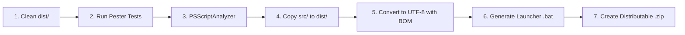

# 配布を見据えた PowerShell プロジェクト標準ディレクトリ構成とビルド設計

開発時のソースコード管理（保守性・テスタビリティ重視）と、エンドユーザーへの配布物（不要ファイル排除・起動性・堅牢性重視）は明確に責務が異なります。
開発初期から **「配布を意識したディレクトリ構成」** を採用することで、リリース作業の自動化と品質担保が容易になります。

---

## 1. 2大プロジェクト標準レイアウト

### パターン 1: 単体ツール・業務スクリプト向け（Tool / App Distribution）
エンドユーザー向けバッチ配布や、社内キッティング・運用自動化ツール開発の標準構成です。

```
MyToolProject/
├── src/                        # ソースコード本体
│   ├── MyTool.ps1              # メインスクリプト（UTF-8 with BOM）
│   └── lib/                    # 補助スクリプト・設定・静的データ
│       ├── Helper.ps1
│       └── config.json
├── tests/                      # テストコード（配布物には含めない）
│   └── MyTool.Tests.ps1        # Pester ユニットテスト
├── build/                      # ビルド＆パッケージング自動化
│   └── build.ps1               # src/ から dist/ を生成するスクリプト
├── dist/                       # 【配布成果物】（.gitignore対象、CI/ビルドで生成）
│   ├── MyTool.bat              # バッチランチャー
│   ├── MyTool.ps1              # クレンジング済みスクリプト
│   ├── lib/
│   └── MyTool-v1.0.0.zip       # 配布用アーカイブ
├── docs/                       # 設計書・マニュアル（配布用とは分離）
├── .gitignore
└── README.md
```

---

### パターン 2: PowerShell モジュール開発向け（Module Distribution）
PSGallery / Azure Artifacts / PSResourceGet 配布や社内共通ライブラリ開発の標準構成です。

```
MyModuleProject/
├── src/                        # モジュールソース
│   ├── MyModule.psd1           # マニフェスト（バージョン・メタデータ）
│   ├── MyModule.psm1           # ルートモジュール（Public/Privateローダー）
│   ├── Public/                 # 外部公開関数（1関数1ファイル）
│   │   ├── Get-MyResource.ps1
│   │   └── Set-MyResource.ps1
│   └── Private/                # 内部専用関数（非公開）
│       └── Test-IsAdmin.ps1
├── tests/                      # Pester テスト & PSScriptAnalyzer 解析
│   ├── Unit/
│   │   └── Get-MyResource.Tests.ps1
│   └── Quality/
│       └── Analyzer.Tests.ps1
├── build/
│   └── build.ps1               # モジュールマージ、構文検証、dist生成
├── dist/                       # 【配布成果物】公開用クリーンモジュール
│   └── MyModule/
│       ├── MyModule.psd1
│       ├── MyModule.psm1
│       └── ...
└── README.md
```

---

## 2. 開発ディレクトリから配布物（`dist/`）を生成するビルドパイプライン

### なぜ `src/` から `dist/` へのビルドが必要なのか？
1. **不要ファイルの混入防止**:
   - `tests/`、`.git`、`.vscode`、`build.ps1`、開発用メモなどの不要・機密ファイルを配布物から完全に除外します。
2. **文字コードの自動統一（UTF-8 BOM強制）**:
   - 開発者が VS Code 等で「BOMなしUTF-8」で保存してしまっても、ビルド時に自動で **「UTF-8 with BOM」** に変換して PS 5.1 での文字化けを防ぎます。
3. **バッチラッパーの自動付与**:
   - `dist/` 内のメインスクリプトに対して、自動的に `MyTool.bat`（Bypass / UTF-8 / 引数転送付き）を生成します。
4. **ZIP パッケージの自動生成**:
   - リリース用の配布用 ZIP ファイルを一括生成します。

---

## 3. 標準ビルドスクリプト（`build/build.ps1`）の仕様

ビルドスクリプトは以下のステップを自動実行します：


