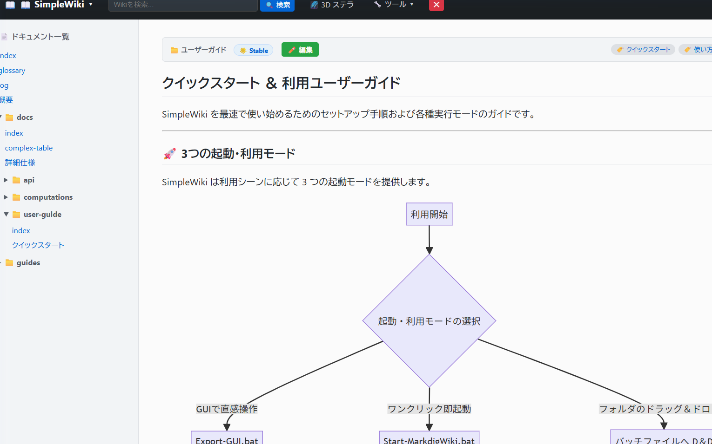

# SimpleWiki

Windows PowerShell 5.1 / PowerShell 7+ および Windows 11 環境で動作する **100% オフライン対応 Markdown Wiki サーバー ＆ LLM RAG AI チャット ＆ 静的 HTML エキスポートツール** です。

---

## イメージ




---

## プロジェクト記録 (Evidence-Based Project Record)

- **開発目的**:
  1. 任意ディレクトリの Markdown ドキュメント群を閉域網・オフライン環境で即座に Web Wiki 化。
  2. IIS, Nginx, Apache などの外部 Web サーバー向けに一括で静的 HTML サイトを生成・デプロイ。
  3. WinRT 形態素解析と LLM RAG による閉域網・ローカル AI チャットアシスタントの統合。
  4. 高度な検索エンジン（AND/NOT構文・除外検索・インデックスキャッシュ）による高速なナレッジ検索。
  5. 多言語化（i18n: 日本語 / 英語 / 外部辞書拡張）によるグローバル対応。
  6. GUI ツール (`Export-GUI.bat`) による直感的なフォルダ選択とエキスポート。
- **アーキテクチャ概要**:
  - **リアルタイム閲覧 & OKF ナレッジハブ**: `System.Net.HttpListener` によるローカル Web サーバー (`http://localhost:8080/`)
    - **🧩 サーバーモジュール化 ＆ スリムアーキテクチャ (`lib/WikiServer.ps1`, `lib/WikiEditorTemplate.ps1`)**:
      - `Start-MarkdigWiki.ps1` を約1,975行から約150行の軽量エントリーポイントへとスリム化。
      - HTTP ルーティング・エンドポイントディスパッチ・SSE ストリーミング・シャットダウン処理を `lib/WikiServer.ps1`（`Invoke-WikiRouteRequest`）へ集約。
      - OKF 分離エディターモーダルの HTML/JS テンプレートおよび動的トークンバインド処理を `lib/WikiEditorTemplate.ps1`（`Get-WikiEditorModalHtml`）へ分離。
      - 共通レイアウト描画を `lib/WikiViews.ps1`（`Get-MainViewHtml`）へ集約し、保守性とテスト独立性を向上。
  - **🌐 多言語化 (i18n) ＆ 言語セレクタ ＆ 外部辞書拡張 (`lib/WikiI18n.ps1`)**:
    - **日本語 (`ja`) / 英語 (`en`)** の標準ビルトイン辞書を搭載。
    - ヘッダーの言語セレクタドロップダウンによるワンクリック即時切り替え（Cookie 保存）。
    - クエリパラメータ (`?lang=en`) によるダイレクト言語指定および静的エキスポート (`-Language en`) 対応。
    - ルート直下の `i18n.json` による外部辞書拡張（中国語等の新規言語追加や既存文言の上書き）。
    - チャットプロンプト（Fast RAG / Agentic RAG）およびコンテキスト見出し・思考ログ・フォールバック回答の自動ローカライズ。
  - **🔍 高度な OKF 検索エンジン ＆ NOT 構文（除外検索） ＆ インデックスキャッシュ**:
    - **WinRT 日本語形態素解析 (`Get-JapaneseWordsWinRT`)**: Windows 10/11 OS 内蔵の `Windows.Data.Text.WordsSegmenter` による完全依存 0 の分かち書き ＆ 助詞ストップワード自動除去。
    - **AND 検索 ＆ フレーズ完全一致ボーナス**: 複数キーワードの絞り込みと自然文フレーズ加点。
    - **🚫 NOT 構文（除外検索）**: `-キーワード`, `NOT キーワード`, `!キーワード`, `NOT "フレーズ"` をサポート。単語中ハイフン（`K-DAT`）の誤認を防止する堅牢なパーサー。
    - **⚡ ローカル集約ディスクキャッシュ (`.cache/.index-cache-<hash>.json`)**: 起動元スクリプト配下にフォルダごとのハッシュ付きキャッシュを個別保存。OneDrive等のクラウド同期ドライブや読み取り専用共有フォルダでも競合・汚染を起こさず安全に高速化。ファイル削除・更新を検知してゾンビキャッシュを自動排除。
  - **⚙️ Web 設定管理画面 (`/settings`) ＆ 編集 ON/OFF トグル ＆ 読み取り専用ガード**:
    - Web ブラウザ上からのエディター機能 ON/OFF トグル、バックアップ世代数、検索キャッシュ、起動時インデックス、RAG 設定の変更・保存。
    - エディター機能を無効化（`editor.enabled: false`）することで社内共有フォルダや LAN 公開時の誤操作・ファイル改ざんを防止（読み取り専用モード）。
    - 読み取り専用モード時は UI 上の「✏️ 編集」ボタンが非表示になり、サーバー API (`/api/save`) でも `403 Forbidden` を返却して書き込みを二重ブロック。
    - `config.json` 保存時の **3世代ローテーションバックアップ (`.bak1` 〜 `.bak3`)** とアトミック安全書き込み。
    - 「今すぐインデックス再生成」および「🗑️ ローカルキャッシュ全消去」ボタンによる一括クリーンアップ ＆ 非同期ローディング UI。
  - **🤖 2モード制 LLM RAG AI チャットアシスタント ＆ POST `/api/chat` API**:
    - **🌊 SSE リアルタイムストリーミング表示 ＆ 非ストリーム自動フォールバック**: トークン単位でのスムーズな逐次出力。LLM API がストリーム非対応の場合でも自動で一括描画へフォールバック。
    - **⚡ Fast RAG (高速1-Pass)** / **🧠 Agentic RAG (ReAct自律調査)** の2モード選択トグル機能。
    - **4つの Agentic Tools**: `search_okf` (重み付け・NOT検索対応), `lookup_glossary` (用語定義抽出), `read_doc` (本文取得・非推奨警告), `get_linked_docs` (相対リンク追跡) による自律探索。
    - **思考プロセス (`thinkingLog`) のリアルタイム可視化**: 自律調査ステップを SSE イベントで逐次受信し、アコーディオン開閉で探索ステップを追跡。
    - さくら AI API / Ollama / LM Studio / OpenAI 等の各種 REST LLM エンドポイントへ対応。
    - **マルチターン対話履歴 (history) 管理 ＆ 安全文字数ガード**: `config.json` で可変調整（`maxHistoryTurns: 3`, `maxHistoryChars: 4000`, `maxAgentTurns: 5`, `maxDocCharLength: 2000`）。
    - **高度なチャット UI**: Markdown 表（`<table>`）、コードブロック（`<pre><code>`）、リストの完全描画、`📋 コピー` ボタン、`⛶ 拡大/縮小` トグル、`🧹 履歴クリア` ボタンを標準搭載。
  - **🔑 マシンバインド・アクティベーション ＆ 管理者用コード発行 CLI ＆ 完全サーバーレス Web アプリ**:
    - **PC 固有ロック (Machine-Bound)**: ユーザー環境のマザーボード UUID（`Get-MachineFingerprint`）から生成された 16 文字のマシン ID およびメールアドレス（任意）に基づいて暗号化キーを派生し、他人の PC では復号できないアクティベーションコード（`ENC:...`）を発行。
    - **完全サーバーレス Web アプリ (`docs/activation/index.html`)**: ブラウザ標準の Web Crypto API を活用し、外部通信・サーバー処理・npm 依存ゼロ（完全クライアントサイド完結）でコードを生成。GitHub Pages 対応。
    - **管理者用 CLI ツール (`New-ActivationCode.bat` / `New-ActivationCode.ps1`)**: コマンドラインまたは対話形式で即座にマシン固有コード / 従来ポータブルコードを生成してクリップボードに自動コピー。
    - **設定 UI でのマシン ID 表示 ＆ ワンクリックコピー**: 設定画面（`/settings`）に自 PC のマシン ID とコピー用ボタンを配置。マシン ID を管理者に申請して発行コードを受け取るだけのスムーズな運用を実現。
    - **DPAPI 自動変換 ＆ ローカル保護**: ユーザーが設定画面でアクティベーションコード（`ENC:...`）を入力して保存すると、サーバー側で自 PC のマシン ID を検証後、Windows 固有の `DPAPI:...` 形式に自動変換して `config.json` に安全に保存。
  - **🔒 API Key 暗号化ユーティリティ (`Set-ApiKey.bat` / `Set-ApiKey.ps1`)**:
    - Windows DPAPI またはポータブル AES-256 暗号化（`ENC:...` / `DPAPI:...`）により、`config.json` 内の API キーを安全に保護。
  - **🛑 安全なサーバー終了 ＆ UI シャットダウンボタン ＆ 非同期待機 (`/api/shutdown`)**:
    - **ワンクリック UI 終了**: 画面右上の「⏻ 終了 / ⏻ Shutdown」ボタンおよび設定画面（`/settings`）の「🛑 サーバー制御」からサーバーを安全に停止。
    - **誤操作防止 ＆ 全画面案内**: 停止前の確認ダイアログ（`confirm`）と停止完了後の全画面案内オーバーレイ（`#shutdownOverlay`）を表示。
    - **Ctrl + C (SIGINT) 即時終了**: `BeginGetContext` による 200ms 非同期ポーリング待機および `[System.Console]::CancelKeyPress` ハンドラにより、バッチファイル (`.bat`) 起動時やコンソールからの `Ctrl + C` でスレッドをブロッキングさせず即座に正常停止。
  - **Google OKF (Open Knowledge Format) v0.2 思想の準拠**: YAML Front Matter からの文脈抽出・自動補完 (フォールバック)・Version / Reviewer / Contributors / Related メタデータカード描画
  - **AI エージェント / LLM 用機械可読 API**: `/api/index.json` (メタデータ), `/api/chunks.json` (自動セマンティック分割チャンク), `/api/chat` (AI チャット), `/api/config` (設定管理), `/api/shutdown` (サーバー停止)
  - **✏️ Web UI 内蔵 Markdown エディター ＆ OKF フォーム・本文分離編集 ＆ 世代管理バックアップ・復元 ＆ ON/OFF 制御**:
    - **OKF フォーム＆本文 分離編集モーダル**: メタデータ（YAML Front Matter）と本文（Markdown Body）を分離して直感的に編集可能。
    - **📋 フォーム入力モード**: OKF v0.2 仕様に準拠した項目（`type`, `title`, `status` (`draft` | `stable` | `deprecated`), `version`, `domain`, `author`, `reviewer`, `lastUpdated`, `tags`, `related`, `supersededBy`）を直感的に編集。元のファイル記載値をデフォルト値として忠実に復元・保持。更新日フィールドと「📅 今日をセット」ボタン付き。
    - **📄 RAW YAML モード**: YAML テキストをそのまま直接編集可能。手動入力時の `---` 囲み記号の自動サニタイズに対応。
    - **双方向同期**: フォーム入力と RAW YAML 間のタブ切り替えで即座に双方向同期。OKF 仕様外のカスタムプロパティも消失せず安全に保持。
    - **キーボードショートカット**: `Ctrl+S` / `Cmd+S` による即時保存、`Esc` によるモーダルクローズに対応。
    - **YAML なし Markdown との完全互換**: YAML がないプレーン Markdown ファイルでも H1 見出しからのタイトル自動抽出や安全なフォールバックにより一切エラーなく動作。
    - 設定画面からのエディター機能 ON/OFF 切替による閲覧専用（読み取り専用モード）制御とサーバーサイド書き込み保護 (`403 Forbidden`)。
    - `config.json` の `editor.maxBackups` (既定値 3) に基づく自動世代バックアップローテーション (`.bak1`, `.bak2`, ...)。
    - エディターモーダル上での過去世代ドロップダウンプレビュー選択 ＆ ワンクリックでのロールバック復元 UI。
    - 保存時の OKF (YAML Front Matter) 構文エラー自動検出 ＆ マイルドなアドバイス表示 (ソフトLint)。
    - エディター内の各メッセージ（読込中・保存完了・バックアップ世代ラベル・構文警告）の 100% 多言語化 (i18n) バインド。
  - **📖 用語連動型タグ・逆リンク拡張 ＆ 自動タグ同期 CLI (`Update-WikiTags.ps1`) ＆ 用語解説 Markdown ボックス**:
    - **`glossary.md` 用語抽出**: `Get-GlossaryTerms` / `Get-GlossaryTermDefinition` により、見出しやエイリアス表記（例: `OKF (Open Knowledge Format)`）から用語と解説を構造化抽出。
    - **自動タグ同期 CLI (`Update-WikiTags.ps1`)**: 全ドキュメント本文をスキャンし、検出用語を既存の `tags:` を壊さず重複なく自動マージ。`-DryRun` および `-WhatIf` (ShouldProcess) に対応。
    - **Web エディタ用語サジェスト**: `/api/glossary-terms` API と連携した `<datalist id="glossaryTagDatalist">` により、タグ入力時に用語候補をサジェスト。
    - **タグ画面用語解説ボックス**: タグ検索画面（`/tags?tag=...`）の上部に、`glossary.md` 由来の用語解説ボックス（太字・リスト・リンク等のリッチな Markdown レンダリング対応）を表示。
  - **動的ナビゲーション & ビュー**: 最近の更新 (`/recent`), タグ集計/検索 (`/tags`), 品質・メンテナンスダッシュボード (`/maintenance`), 著者ディレクトリ (`/authors`), AND/NOT 検索 (`/search`), システム設定 (`/settings`)
  - **静的エキスポート**: `Export-MarkdigWiki.ps1` による OKF v0.2 メタデータカード同梱型 HTML 一括出力（日英多言語対応）
  - **Markdown レンダリング**: .NET 4.6.2 ビルド版 `Markdig.dll` (GFM テーブル・コードブロック・タスクリスト・YamlFrontMatter 対応)
  - **図形・ダイアグラム**: `lib/mermaid.min.js` 同梱による 100% オフライン Mermaid ダイアグラム表示
- **セキュリティ機能**:
  - `[System.IO.Path]::GetFullPath` による絶対パス判定でのディレクトリトラバーサル防止 (`403 Forbidden`)。
  - `[System.Net.WebUtility]::HtmlEncode` による YAML 属性値・パスの XSS サニタイズ。
- **ファイルエンコーディング規約 (`AGENTS.md`)**:
  - スクリプトファイル (`.ps1`, `.psm1`, `.psd1`): **UTF-8 with BOM (`EF BB BF`)** (Windows PowerShell 5.1 での日本語化け防止)
  - バッチファイル (`.bat`): **UTF-8 without BOM (No-BOM)** (`cmd.exe` の `・ｿ` エラー防止)

---

## フォルダ構成

```text
SimpleWiki/
├── Start-MarkdigWiki.ps1   <-- Web サーバー & RAG AI チャット起動スクリプト (UTF-8 with BOM)
├── Start-MarkdigWiki.bat   <-- Web サーバー起動バッチ (UTF-8 No-BOM)
├── Update-WikiTags.ps1     <-- glossary.md 用語のタグ自動マージ・同期スクリプト (UTF-8 with BOM)
├── New-ActivationCode.ps1  <-- マシンバインド/ポータブル アクティベーションコード生成 CLI (UTF-8 with BOM)
├── New-ActivationCode.bat  <-- アクティベーションコード生成バッチ (UTF-8 No-BOM)
├── Set-ApiKey.ps1          <-- LLM API キー暗号化・設定スクリプト (UTF-8 with BOM)
├── Set-ApiKey.bat          <-- API キー設定用 ExecutionPolicy Bypass バッチ (UTF-8 No-BOM)
├── Export-MarkdigWiki.ps1  <-- OKF 対応静的 HTML エキスポートスクリプト (UTF-8 with BOM)
├── Export-MarkdigWiki.bat  <-- 静的 HTML エキスポートバッチ (UTF-8 No-BOM)
├── Export-GUI.ps1          <-- 静的 HTML エキスポート GUI (UTF-8 with BOM)
├── Export-GUI.bat          <-- GUI 起動用バッチ (UTF-8 No-BOM)
├── config.json.example     <-- 設定ファイルテンプレート
├── config.json             <-- ローカル設定（自動生成・暗号化保存）
├── i18n.json.example       <-- 外部辞書拡張テンプレート
├── templates/
│   └── okf-template.md     <-- OKF v0.2 準拠ドキュメント新規作成テンプレート
├── lib/
│   ├── Markdig.dll          <-- .NET Framework 4.6.2 ビルド版 Markdig.dll
│   ├── System.Memory.dll    <-- .NET 4.8 依存アセンブリ
│   ├── WikiI18n.ps1         <-- 多言語化 (i18n) 辞書 ＆ 言語判定モジュール
│   ├── WikiMetadata.ps1     <-- OKF メタデータ抽出 & YAML 構文検証 & 用語集パーサー
│   ├── WikiSearch.ps1       <-- 検索エンジン・WinRT 形態素解析・NOT構文・インデックスキャッシュ
│   ├── WikiRag.ps1          <-- LLM RAG (Fast/Agentic) ＆ チャット API
│   ├── WikiViews.ps1        <-- 各種 HTML ビュー ＆ UI レンダラー
│   ├── WikiSecurity.ps1     <-- マシンID指紋・AES-256 / DPAPI 暗号化 ＆ パス検証
│   └── mermaid.min.js       <-- オフライン用 Mermaid.js (MIT License)
├── markdown_sample/         <-- サンプルドキュメントフォルダ (OKF メタデータ記述例付き)
│   ├── index.md             <-- トップページ
│   ├── 概要.md               <-- プロジェクト概要
│   ├── glossary.md          <-- 社内用語定義集
│   ├── docs/
│   │   ├── 詳細仕様.md       <-- サブフォルダ内サンプル
│   │   └── api/
│   │       └── REST-API.md   <-- REST API 仕様書 & AI Agent 連携ガイド
│   └── images/
│       └── architecture.svg <-- サンプル SVG 画像
├── docs/
│   └── activation/
│       └── index.html       <-- 完全サーバーレス型 Web Crypto API アクティベーションコード生成 Web アプリ
├── tests/
│   └── Start-MarkdigWiki.Tests.ps1 <-- Pester 自動テストスイート (全169件)
└── README.md                <-- プロジェクト記録
```

---

## 使い方

### 1. 静的 HTML エキスポート GUI ツール (推奨)

`Export-GUI.bat` をダブルクリックして起動します。

1. **入力 Markdown フォルダ** を参照ボタン（または直接入力）で選択します。
2. **出力先 HTML フォルダ** を選択します。
3. **[🚀 エキスポート実行]** ボタンを押すと、一括で静的 HTML サイトが生成されます。
4. 完了後、ダイアログから出力先フォルダを直接エクスプローラーで開くことができます。

---

### 2. リアルタイム Wiki サーバー ＆ OKF ナレッジハブの起動

#### サンプルドキュメント (`markdown_sample/`) を閲覧する
`Start-MarkdigWiki.bat` をダブルクリックします。

#### 任意のフォルダのドキュメントを閲覧する
- **ドラッグ＆ドロップ**: 閲覧したい Markdown フォルダを `Start-MarkdigWiki.bat` にドラッグ＆ドロップします。
- **PowerShell から実行**:
  ```powershell
  .\Start-MarkdigWiki.ps1 -RootFolder "D:\MyDocs\ProjectWiki" -Port 8080
  ```

#### 提供エンドポイント / 機能
- **`http://localhost:8080/`**: ホーム・Markdown 閲覧画面 (OKF メタデータ付き)
- **`http://localhost:8080/recent`**: 最近の更新ドキュメント一覧
- **`http://localhost:8080/tags`**: タグ目録 / タグクラウド（用語解説ボックス表示）
- **`http://localhost:8080/maintenance`**: 風化ドキュメント (>365日)・下書き・非推奨の管理画面
- **`http://localhost:8080/authors`**: 著者一覧ディレクトリ
- **`http://localhost:8080/search?q=キーワード`**: 全文検索 (AND/NOT 検索対応)
- **`http://localhost:8080/settings`**: システム設定 & インデックス管理画面
- **`http://localhost:8080/api/index.json`**: AI エージェント / LLM 用機械可読 JSON インデックス
- **`http://localhost:8080/api/chunks.json`**: RAG 用自動 H2 見出しセマンティック分割済み JSON チャンク API
- **`http://localhost:8080/api/glossary-terms`**: 用語一覧・タグ・解説取得 API
- **`http://localhost:8080/api/config`**: 設定情報取得・保存・インデックス再構築 API

---

### 3. バッチ / コマンドラインでのエキスポート

#### サンプルドキュメントを `dist/` へ変換する
`Export-MarkdigWiki.bat` をダブルクリックします。

#### 任意フォルダのドキュメントをエキスポートする
- **ドラッグ＆ドロップ**: 変換したい Markdown フォルダを `Export-MarkdigWiki.bat` にドラッグ＆ドロップします。
- **PowerShell から実行**:
  ```powershell
  .\Export-MarkdigWiki.ps1 -RootFolder "D:\MyDocs\ProjectWiki" -OutputDir "C:\inetpub\wwwroot\wiki"
  ```

---

### 4. マシンバインド・アクティベーションコードの発行と適用

SimpleWiki では、API キーを他人に漏洩させずに特定の PC 専用コードとして配布・アクティベーションする仕組みを備えています。

```
【発行手順】
1. ユーザーが SimpleWiki の [システム設定 (⚙️)] を開き、表示されている「マシン ID」をコピーして管理者に伝えます。
2. 管理者が「アクティベーション Web サイト」または「CLI ツール」で対象マシン ID 用のコードを発行します。
   ・Web サイト: docs/activation/index.html (GitHub Pages: https://chottokun.github.io/SimpleWiki/activation/)
   ・CLI ツール: .\New-ActivationCode.bat
3. 発行された「ENC:xxxx...」コードを設定画面の [アクティベーションコード] 欄に貼り付けて保存します。
4. サーバー側で自動的に Windows 固有の保護形式 (DPAPI) に変換され、この PC 専用として永続化されます。
```

---

### 5. 用語連動タグの自動同期 (`Update-WikiTags.ps1`)

`glossary.md` で定義された用語を Markdown 本文から自動検出し、YAML Front Matter の `tags:` に安全にマージします。

```powershell
# 事前確認 (DryRun モード: ファイルを変更せずに更新候補を表示)
.\Update-WikiTags.ps1 -WikiDir "D:\MyDocs\ProjectWiki" -DryRun

# 実際に同期・更新を実行
.\Update-WikiTags.ps1 -WikiDir "D:\MyDocs\ProjectWiki"
```

---

## 依存ライブラリと Windows 11 互換性について

### **完全スタンドアロン（追加インストール不要）**
- **Windows 11 標準動作保証**: Windows 11 に標準でプリインストールされている **Windows PowerShell 5.1** および **.NET Framework 4.8** の環境のみでそのまま起動・動作します。
- **事前同梱ライブラリ (`lib/`)**:
  - `Markdig.dll`: .NET Framework 4.6.2 ビルド版 Markdown パーサー (GFM / YAML Front Matter 対応)
  - `System.Memory.dll` / `System.Buffers.dll` / `System.Numerics.Vectors.dll` / `System.Runtime.CompilerServices.Unsafe.dll`: .NET 依存補助アセンブリ
  - `mermaid.min.js`: オフライン表示用 Mermaid.js ライブラリ
- **インターネット接続不要**: `nuget` や `npm` によるオンラインパッケージ取得、管理者権限のインストール作業は一切不要です。リポジトリを展開するだけで 100% 閉域網・オフライン環境で動作します。

---

## テストと品質検証

### 3段階の品質検証フェーズ (Syntax AST / Pester / E2E Export)
```powershell
powershell -NoProfile -ExecutionPolicy Bypass -Command "Invoke-Pester -Path .\tests\Start-MarkdigWiki.Tests.ps1"
```
- **検証結果**: 全 173 件の Pester 自動テストが **100% PASS**。
  - **1. スクリプト構文・AST検証**: 全 `.ps1` ファイルの構文解析・トークン検証に合格
  - **2. Pester 単体・統合・セキュリティ・多言語・OKF v0.2 テスト (全 173 件)**:
    - サーバーモジュール化 ＆ テンプレート分離検証（PR #40: `Start-MarkdigWiki.ps1` のスリム化に伴う `Invoke-WikiRouteRequest` / `Get-WikiEditorModalHtml` / `Get-MainViewHtml` の独立性・PSCustomObject パラメータバインディング検証、エディター内 i18n トークン正常展開・多言語バインド検証、PSScriptAnalyzer 静的解析警告 0 件の維持）
    - PSScriptAnalyzer 静的解析の残存警告完全解消（リポジトリ全体・lib・tests・.agents/skills スクリプトで 0 warnings を達成。PR #39 での Write-Host 引数修正、WikiRag の未使用変数・パラメータ・$null比較順序改善、および各モジュールの適切な SuppressMessageAttribute / 空 catch ブロック対策の適用）
    - View コンポーネントリファクタリング検証（`Get-OkfFooterCardHtml` の Description 描画、`Get-MaintenanceViewHtml` のリストレンダラー共通化）
    - `glossary.md` からの用語・見出し・定義・エイリアス抽出テスト (`Get-GlossaryTerms`, `Get-GlossaryTermDefinition`)
    - `Update-WikiTags.ps1` の `-DryRun` 非破壊検証および既存タグを保持した自動マージテスト
    - タグ詳細画面（`/tags?tag=...`）での用語解説ボックス表示および Markdig リッチ Markdown レンダリング検証
    - エディター機能 ON/OFF トグル設定およびバックアップ世代数の `/settings` UI レンダリング ＆ `/api/config` 保存・パーステスト
    - `editor.enabled` 無効化（`false`）時の UI トップバー「✏️ 編集」ボタン非表示化テスト
    - `editor.enabled` 無効化時の `/api/save` 書き込みリクエストに対する `403 Forbidden` ガードテスト
    - マシン固有 ID（`Get-MachineFingerprint`）生成・16文字フォーマット検証
    - マシンバインド・アクティベーションコード暗号化／復号（同一マシン・同一メールでの復号成功）
    - 異なるマシン ID／誤ったメールアドレスでの復号失敗（防犯性）検証
    - 従来ポータブル `ENC:...` 形式の透過的復号・後方互換性テスト
    - 完全サーバーレス Web アプリ（`docs/activation/index.html`）の Web Crypto API 出力コードと PowerShell 間の 100% 復号互換性テスト
    - `/api/config` 経由でのアクティベーションコード送信 ➡ DPAPI 自動変換 ＆ 無効コード時の 400 Bad Request 拒絶検証
    - Markdig アセンブリロード & GFM パイプライン構築
    - 多言語化 (i18n) 辞書・言語判定（クエリ/Cookie/設定優先度）・外部辞書 `i18n.json` マージ
    - 英語・日本語での UI HTML ビュー生成（サイドバー・トップバー・フッター・各動的画面）
    - チャットプロンプト（Fast RAG / Agentic RAG）およびコンテキスト見出し・思考ログ・フォールバックの多言語化
    - OKF v0.2 拡張フィールド（Version, Reviewer, Contributors, SupersededBy, Related）およびライフサイクルステータス（stable等）のパースとレンダリング
    - 完全メタデータ欠落時のスマートフォールバック（ファイル日時欠落時の「不明」扱い保証）
    - ディレクトリトラバーサル防止 (`403 Forbidden`)
    - XSS サニタイズ (404 パス、タイトル、検索フォーム、OKF 属性値)
    - OKF メタデータ解析・YAML パース例外処理・自動補完 (フォールバック)・カンマ区切りタグ対応
    - OKF 動的ビュー生成 (`/recent`, `/tags`, `/maintenance`, `/authors`, `/search`, `/settings`)
    - OKF 文脈検索エンジン重み付けスコアリング & AND 条件検索
    - 検索クエリ NOT 構文（`-単語`, `NOT 単語`, `!単語`, `NOT "フレーズ"`）による除外検索
    - 検索インデックスのディスクキャッシュ・ファイル削除/更新検知（ゾンビファイル防止）
    - 大規模ドキュメント群のインデックス構築進捗追跡 (`Get-WikiIndexingStatus`, `/api/indexing-status`) ＆ Web UI / コンソールプログレス表示
    - 設定保存時の 3世代ローテーションバックアップ (`.bak1`〜`.bak3`) ＆ アトミック保存
    - 全角スペース（`U+3000`）による検索単語分解対応
    - URL エンコードされた UTF-8 日本語クエリパラメータのデコード (`Get-QueryParams`)
    - クライアント接続切断時のソケット例外非破壊保護 (`Write-SafeHttpResponse`)
    - AI エージェント用 API JSON 出力 (`/api/index.json`)
    - RAG 用セマンティックチャンク自動分割 API 出力 (`/api/chunks.json`)
    - Agentic RAG / Fast RAG AI チャット API (`/api/chat`)
    - 静的 HTML エキスポート (`Export-MarkdigWiki.ps1`) の `-Language` オプションとメタデータカード統合
    - 全 PowerShell ファイルの UTF-8 with BOM およびバッチファイルの UTF-8 No-BOM エンコーディング検証
  - **3. E2E エキスポート検証**: 実フォルダでの全 HTML 相互リンク・CSS/JS 出力検証に成功


---

## ライセンス・第三者ソフトウェア表記について

* **本プロジェクト (SimpleWiki)**: **MIT License**
* **第三者オープンソースアセンブリ / ライブラリ**:
  - `Markdig.dll`: MIT License
  - `mermaid.min.js`: MIT License
  - `.NET System.*` アセンブリ: MIT License (by .NET Foundation)

詳細なライセンス全文および著作権表示は [LICENSE.md](LICENSE.md) をご覧ください。商用・個人利用・社内展開を含め自由に再配布いただけます。


