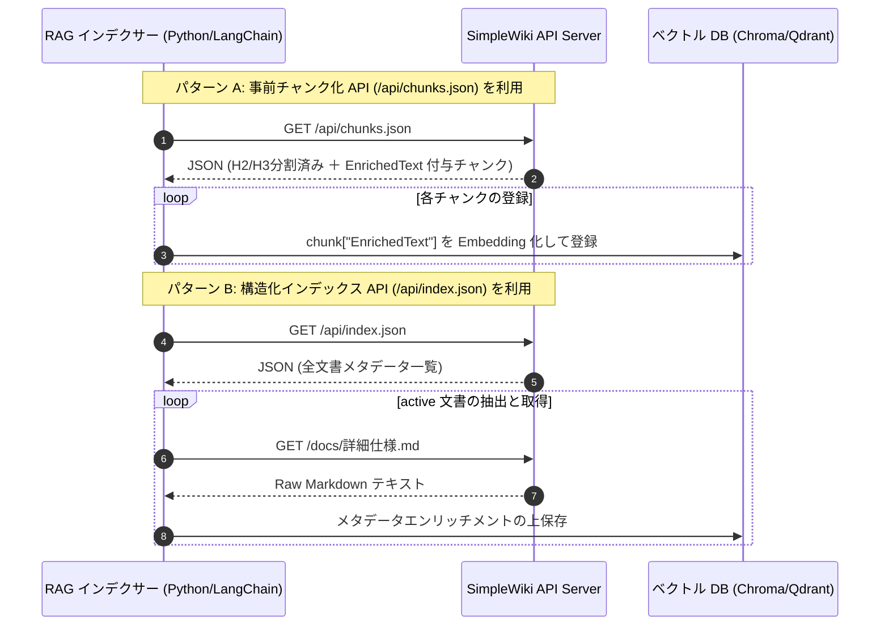

# REST API 仕様書 ＆ AI Agent / RAG 連携ガイド

SimpleWiki が提供する AI エージェント（RAG / LLM）および外部ツール向けの構造化 JSON API エンドポイントの仕様書です。

---

## 📡 提供エンドポイント一覧

| メソッド | エンドポイント | 用途・説明 | パラメータ | 認証 |
| :--- | :--- | :--- | :--- | :--- |
| `GET` | `/api/index.json` | Wiki 全件の OKF メタデータ構造化一覧を取得 | なし | 不要 |
| `GET` | `/api/chunks.json` | RAG 用自動 H2/H3 見出し分割済み JSON チャンク一覧を取得 | なし | 不要 |
| `POST` | `/api/chat` | OKF 文脈検索 ＋ LLM RAG AI チャット応答を取得 | `{"message": "質問文"}` | 不要 (`config.json` 依存) |
| `GET` | `/*.md` | 指定相対パスの Raw Markdown 本文を取得 | なし | 不要 |

---

## 🔄 RAG データ取得フロー (Mermaid シーケンス図デモ)

SimpleWiki を RAG のナレッジデータソース（Producer）として利用する際のシーケンス図です。



---

## 1. 全文書メタデータインデックス API (`/api/index.json`)

### レスポンス構造例:
```json
[
  {
    "Title": "REST API 仕様書 ＆ AI Agent / RAG 連携ガイド",
    "Description": "AI エージェントおよび RAG パイプライン向け機械可読 JSON API エンドポイントの仕様書です。",
    "Author": "API 開発チーム",
    "Domain": "仕様/API",
    "Tags": ["API", "RAG", "JSON", "LLM"],
    "LastUpdated": "2026-08-09T00:00:00Z",
    "Status": "active",
    "HasYaml": true,
    "RelPath": "docs/api/REST-API.md"
  }
]
```

---

## 2. RAG 用自動チャンク分割 API (`/api/chunks.json`)

Markdown 本文を `#`, `##`, `###` の見出し単位で自動分割し、文脈ヘッダー (`EnrichedText`) をプリセットしたレスポンスです。

### レスポンス構造例:
```json
[
  {
    "ChunkId": "docs/api/REST-API.md#chunk-1",
    "RelPath": "docs/api/REST-API.md",
    "Title": "REST API 仕様書 ＆ AI Agent / RAG 連携ガイド",
    "Domain": "仕様/API",
    "Section": "1. 全文書メタデータインデックス API (/api/index.json)",
    "Tags": ["API", "RAG", "JSON"],
    "LastUpdated": "2026-08-10T00:00:00Z",
    "Status": "active",
    "Content": "### レスポンス構造例:\n```json\n[ ... ]\n```",
    "EnrichedText": "[Document: REST API 仕様書 | Domain: 仕様/API | Section: 1. 全文書メタデータインデックス API | Tags: API, RAG]\n\n### レスポンス構造例:\n```json\n[ ... ]\n```"
  }
]
```

---

## 3. 2モード制 OKF RAG LLM AI チャット API (`/api/chat`)

Wiki 内の `status: active` ドキュメントを自動文脈検索し、グラウンディング（根拠に基づく回答）された AI 応答を取得する POST エンドポイントです。
**`mode` パラメータ**に `"fast"` (低遅延1-Pass) または `"agentic"` (ReAct自律調査) を指定できます。

### リクエスト例 (POST):
```json
{
  "mode": "agentic",
  "message": "基幹DBの復旧手順と、そこで使う用語『K-DAT』の注意点をまとめて",
  "history": [
    { "role": "user", "content": "こんにちは" },
    { "role": "assistant", "content": "社内Wikiアシスタントです。何かお手伝いできますか？" }
  ]
}
```

### レスポンス構造例 (Agentic モード):
```json
{
  "mode": "agentic",
  "answer": "『K-DAT』はデータバックアップツールです。基幹DBの復旧は以下の手順で行います...",
  "thinkingLog": [
    "🔍 Tool Call: lookup_glossary (term: 'K-DAT')",
    "🔍 Tool Call: search_okf (query: '基幹DB 復旧', domain: '')",
    "📄 Tool Call: read_doc (relPath: 'docs/infrastructure/db.md')"
  ],
  "sources": [
    {
      "title": "社内用語定義集",
      "relPath": "glossary.md",
      "relUri": "/glossary.md",
      "lastUpdated": "2026-08-10",
      "author": "ナレッジ管理チーム"
    }
  ]
}
```

---

## 💻 Python (LangChain) からの最小呼び出しコード

```python
import requests

# SimpleWiki の /api/chunks.json から1回のリクエストで完成チャンクを取得
chunks = requests.get("http://localhost:8080/api/chunks.json").json()

for chunk in chunks:
    if chunk["Status"] == "active":
        print(f"Ingesting: {chunk['ChunkId']} (Section: {chunk['Section']})")
        # vector_db.add(text=chunk["EnrichedText"], metadata=chunk)
```

---

## 🔗 関連ページへの移動
- [詳細仕様書を見る](../詳細仕様.md)
- [開発環境構築ガイドを見る](../../guides/環境構築.md)
- [ポータルに戻る](../../index.md)
