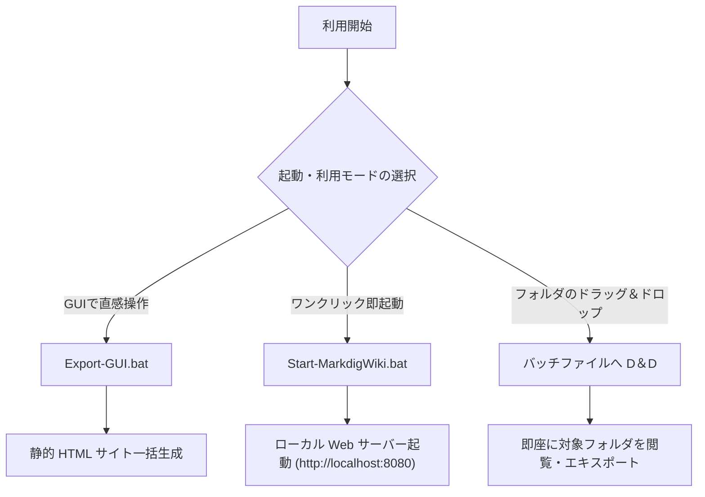
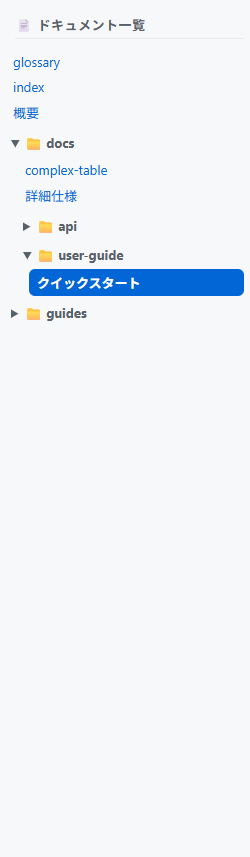
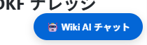

# クイックスタート ＆ 利用ユーザーガイド

SimpleWiki を最速で使い始めるためのセットアップ手順および各種実行モードのガイドです。

---

## 🚀 3つの起動・利用モード

SimpleWiki は利用シーンに応じて 3 つの起動モードを提供します。



---

## Mode 1: ローカル Web サーバー起動 (閲覧 ＆ OKF ナレッジハブ)

1. `Start-MarkdigWiki.bat` をダブルクリックします。
2. 既定のブラウザが起動し、`http://localhost:8080/` が表示されます。
3. ナビゲーションヘッダーおよび左サイドバーからドキュメントを探索できます。


*図 1: ヘッダーメニュー（トップ/最近の更新/タグ一覧/メンテナンス/著者一覧/API/検索バー）*


*図 2: ドキュメントツリーによる階層切り替え*

4. ディレクトリ内に `.md` ファイルを追加・編集するとリアルタイムで更新されます。

### 任意フォルダを指定して起動する
- **ドラッグ＆ドロップ**: 閲覧したい Markdown フォルダを `Start-MarkdigWiki.bat` アイコンへドラッグ＆ドロップ。
- **PowerShell から実行**:
  ```powershell
  .\Start-MarkdigWiki.ps1 -RootFolder "D:\MyProjects\Docs" -Port 8080
  ```

### 🌐 言語切り替え (日本語 / 英語)
- ヘッダー右上の言語ドロップダウンセレクタから **`日本語`** / **`English`** を即時切り替え可能。
- 選択した言語設定はブラウザ Cookie に自動保存されます。

---

## Mode 2: 静的 HTML エキスポート (外部サーバー公開用)

- **GUI で実行**: `Export-GUI.bat` を起動してフォルダを選択。
- **コマンドラインで実行**:
  ```powershell
  .\Export-MarkdigWiki.ps1 -RootFolder "D:\MyProjects\Docs" -OutputDir "C:\inetpub\wwwroot\wiki" -Language en
  ```
  *(※ `-Language` または `-Lang` に `en` を指定すると、英語表記の HTML サイトを生成します)*

---

## Mode 3: LLM RAG AI チャットの設定 ＆ 利用

閉域網 API（さくら AI API等）やローカル LLM（Ollama, LM Studio）を接続して Wiki 内ナレッジに基づく AI チャットを利用する手順です。

### 1. API キー ＆ エンドポイントの設定 (`Set-ApiKey.bat`)
```cmd
.\Set-ApiKey.bat -ApiUrl "https://api.ai.sakura.ad.jp/v1/" -ApiKey "YOUR_API_KEY" -Model "qwen2.5-72b-instruct"
```
*(※ API キーは Windows DPAPI または AES-256 で自動的に暗号化されて `config.json` に安全に保存されます)*

### 2. チャットウィジェットの操作
- サーバー起動後、画面右下の **`🤖 Wiki AI チャット`** ボタンをクリックします。


*図 3: 画面右下の AI チャット起動ボタン*

- **`⛶ 拡大`**: ウィンドウを大画面表示に切り替え。
- **`📋 コピー`**: AI の回答テキストをワンクリックコピー。
- **`🧹 履歴クリア`**: 対話履歴をリセット。

---

## 📝 新規 OKF ドキュメント作成手順

1. `templates/okf-template.md` をコピーして対象フォルダへ配置します。
2. 冒頭の YAML Front Matter を編集します（`type` を指定し、`title` や `domain` は自動補完されます）。
3. 保存した瞬間から Wiki に自動認識されます。

---

## 🔗 関連ページへの移動
- [詳細仕様書を見る](../詳細仕様.md)
- [ユーザーガイド目次に戻る](index.md)
- [開発環境構築ガイドを見る](../../guides/環境構築.md)
- [ポータルに戻る](../../index.md)
