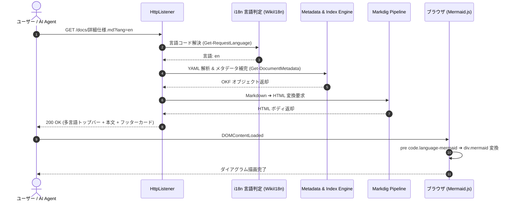
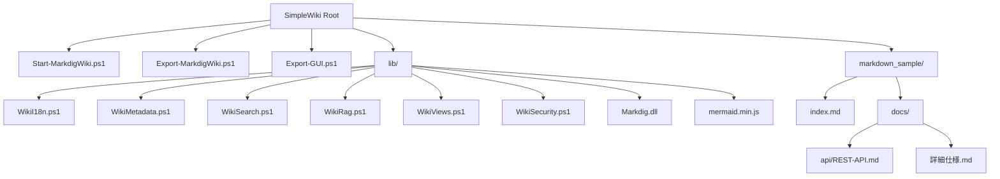

# SimpleWiki 詳細仕様書

本ドキュメントは、SimpleWiki の詳細なルーティング機能、メタデータ補完ロジック、Mermaid.js ダイアグラム表示、およびセキュリティ仕様について記載します。

---

## 🚦 ルーティング仕様

HTTP リクエストを受け取った際のサーバーの分岐動作一覧です。

*図: OKF メタデータカードおよびタグバッジの表示例*

| HTTP パス | 処理内容 | レスポンス形式 |
| :--- | :--- | :--- |
| **`/`** | `index.md`（無ければ `README.md`、どちらも無ければフォルダ一覧）へ内部ルーティング | HTML (200 OK) |
| **`/*.md`** | Markdig により Markdown ➔ HTML 変換して返却 | HTML (200 OK) |
| **`/recent`** | 全文書を更新日降順でソートした最新更新一覧 | HTML (200 OK) |
| **`/tags`** | 全文書のタグ集計・タグクラウド表示 (`/tags?tag=xxx` 絞り込み対応) | HTML (200 OK) |
| **`/maintenance`** | 風化文書 (>365日)・下書き・非推奨の一覧ダッシュボード | HTML (200 OK) |
| **`/authors`** | 著者別グループ化ディレクトリ (`/authors?name=xxx` 対応) | HTML (200 OK) |
| **`/search?q=xxx`** | 全文 AND/NOT 検索（タイトル、本文、タグ、著者、ドメイン対象） | HTML (200 OK) |
| **`/settings`** | 検索キャッシュ・事前インデックス・RAG 設定の管理画面 | HTML (200 OK) |
| **`/api/raw`** | Markdown 原文取得 API (エディタ用) | Text (text/plain) |
| **`/api/save`** | Markdown 保存 ＆ 世代バックアップ API | JSON (application/json) |
| **`/api/config`** | システム設定取得・保存・インデックス再生成 API | JSON (application/json) |
| **`/api/index.json`** | AI / LLM 用機械可読 OKF インデックスデータ | JSON (application/json) |
| **`/api/chunks.json`**| RAG 用セマンティック見出し分割済み JSON チャンク API | JSON (application/json) |
| **`/api/chat`** | OKF 文脈検索 ＋ WinRT 形態素解析 ＋ LLM AI チャット応答 API (Fast/Agentic, SSEストリーミング & JSONフォールバック, 多言語対応) | SSE (text/event-stream) / JSON |

### 🌐 多言語解決優先順位 (i18n)
全 HTML ビューおよびチャット API は以下の優先順位で言語コード（`ja` / `en` 等）を自動判定します：
1. **URL クエリパラメータ**: `?lang=en`
2. **ブラウザ Cookie**: `Cookie: lang=en` (UI 言語セレクタで自動保持)
3. **設定ファイル**: `config.json` の `"defaultLanguage"`
4. **既定値**: `"ja"` (日本語)

---

## 📊 リクエスト処理フロー (Mermaid シーケンス図デモ)

SimpleWiki は 100% オフラインの `lib/mermaid.min.js` を同梱しており、以下のコードブロックを書くだけでブラウザ上に綺麗なダイアグラムが動的描画されます。

---

## 🔄 OKF ステータス遷移図 (Mermaid 状態遷移図デモ)

ドキュメントのライフサイクル（Status）の遷移モデルです。

---

## 📂 ドキュメント階層構造 (Mermaid 構成図デモ)

---

## 📋 OKF (Open Knowledge Format) v0.2 メタデータ仕様 ＆ 自動補完マトリクス

SimpleWiki は Google OKF v0.2 に準拠し、YAML Front Matter の各属性が欠落している場合でも堅牢にフォールバック動作します。

| 属性キー | 必須 | 型 | 記述例 | 欠落時の自動補完（フォールバック動作） |
| :--- | :---: | :--- | :--- | :--- |
| **`type`** | 任意 (OKF必須) | string | `Specification` | `"Document"` |
| **`title`** | 任意 | string | `SimpleWiki 仕様書` | Markdown 先頭の `# 見出し` ➔ ファイル名 ➔ `"Untitled"` |
| **`description`** | 任意 | string | `詳細なルーティング仕様` | 本文先頭 150 文字（記号除去） ➔ 空文字列 |
| **`author`** | 任意 | string | `human:simplewiki-team` | 空文字列（未指定時は非表示） |
| **`contributors`** | 任意 | array | `["山田太郎", "佐藤花子"]` | 空配列（非表示） |
| **`reviewer`** | 任意 | string | `鈴木一郎` | 空文字列（非表示） |
| **`domain`** | 任意 | string | `仕様/コア` | ファイルが属する親フォルダ相対パス（ルートなら `"root"`） |
| **`tags`** | 任意 | array | `["仕様書", "OKF"]` | 空配列（非表示） |
| **`version`** | 任意 | string | `0.2.0` | 空文字列（バッジ非表示） |
| **`last_updated`** | 任意 | date | `2026-08-25` | ファイルの最終更新日時 ➔ 不明時は `"不明"` (`$null`) |
| **`status`** | 任意 | string | `stable` | **`"stable"` / `"active"`** |
| **`superseded_by`**| 任意 | string | `docs/新仕様.md` | 空文字列（警告リンク非表示） |
| **`related`** | 任意 | array | `["docs/api/REST-API.md"]` | 空配列（非表示） |

### 🏷️ OKF v0.2 ライフサイクルステータス一覧
- **`stable` / `active`**: 現行ドキュメント（通常公開中、検索・RAG で最優先）。
- **`draft` / `wip` / `review`**: 下書き・作成中・レビュー中。
- **`deprecated` / `archived` / `obsolete`**: 非推奨・保管・廃止ドキュメント。

---

## 🧮 保証付き計算仕様 (Attested Computation)

- 検索アルゴリズムのスコア算出確定ロジックは [検索スコアリング計算仕様 (Attested Computation)](computations/search-score.md) に定義されています。

---

## 🛡️ エラーコードと対策

| エラーコード | 状況 | 原因とシステム側の対策 |
| :---: | :--- | :--- |
| **403** | Forbidden | ディレクトリトラバーサル防止機能によるブロック。不正な `../` 参照を遮断。 |
| **404** | Not Found | 要求された `.md` または画像アセットが存在しません。XSS 対策済み 404 ページを表示。 |

---

## 🔗 関連ページへの移動
- [REST API 仕様書を見る](api/REST-API.md)
- [HTML 埋め込み表サンプルを見る](complex-table.md)
- [クイックスタートガイドを見る](user-guide/クイックスタート.md)
- [ドキュメント一覧に戻る](index.md)
- [トップポータルに戻る](../index.md)
