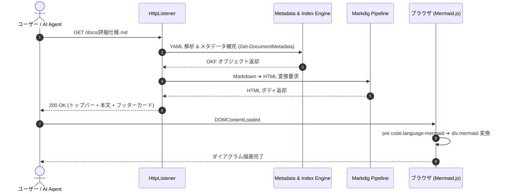
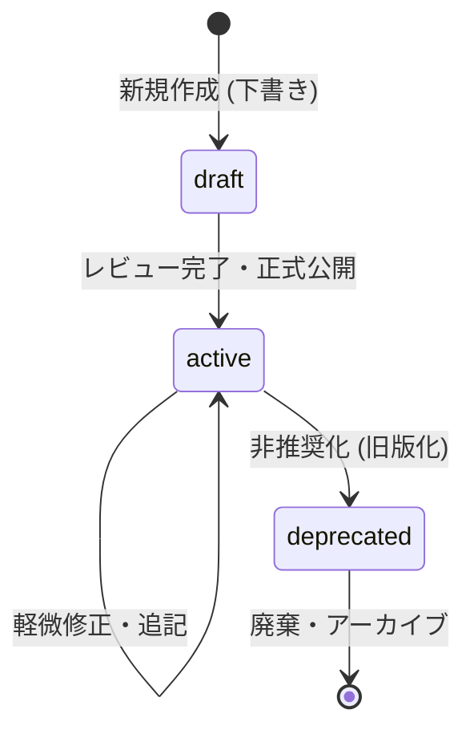
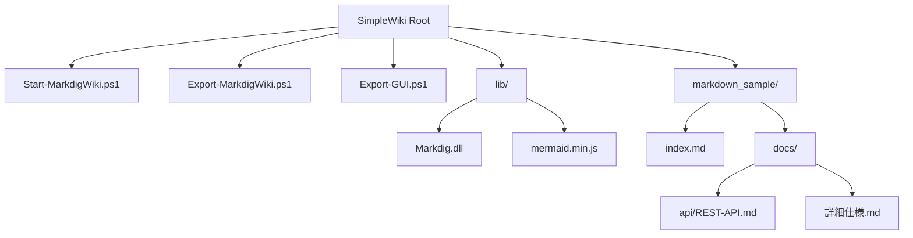

# SimpleWiki 詳細仕様書

本ドキュメントは、SimpleWiki の詳細なルーティング機能、メタデータ補完ロジック、Mermaid.js ダイアグラム表示、およびセキュリティ仕様について記載します。

---

## 🚦 ルーティング仕様

HTTP リクエストを受け取った際のサーバーの分岐動作一覧です。

| HTTP パス | 処理内容 | レスポンス形式 |
| :--- | :--- | :--- |
| **`/`** | `index.md`（無ければ `README.md`）へ内部ルーティング | HTML (200 OK) |
| **`/*.md`** | Markdig により Markdown ➔ HTML 変換して返却 | HTML (200 OK) |
| **`/recent`** | 全文書を更新日降順でソートした最新更新一覧 | HTML (200 OK) |
| **`/tags`** | 全文書のタグ集計・タグクラウド表示 (`/tags?tag=xxx` 絞り込み対応) | HTML (200 OK) |
| **`/maintenance`** | 風化文書 (>365日)・下書き・非推奨の一覧ダッシュボード | HTML (200 OK) |
| **`/authors`** | 著者別グループ化ディレクトリ (`/authors?name=xxx` 対応) | HTML (200 OK) |
| **`/search?q=xxx`** | 全文 AND 検索（タイトル、本文、タグ、著者、ドメイン対象） | HTML (200 OK) |
| **`/api/index.json`** | AI / LLM 用機械可読 OKF インデックスデータ | JSON (application/json) |
| **`/api/chunks.json`**| RAG 用セマンティック見出し分割済み JSON チャンク API | JSON (application/json) |
| **`/api/chat`** | OKF 文脈検索 ＋ WinRT 形態素解析 ＋ LLM AI チャット応答 API | JSON (application/json) |

---

## 📊 リクエスト処理フロー (Mermaid シーケンス図デモ)

SimpleWiki は 100% オフラインの `lib/mermaid.min.js` を同梱しており、以下のコードブロックを書くだけでブラウザ上に綺麗なダイアグラムが動的描画されます。

---

## 🔄 OKF ステータス遷移図 (Mermaid 状態遷移図デモ)

ドキュメントのライフサイクル（Status）の遷移モデルです。

---

## 📂 ドキュメント階層構造 (Mermaid 構成図デモ)

---

## 🛡️ エラーコードと対策

| エラーコード | 状況 | 原因とシステム側の対策 |
| :---: | :--- | :--- |
| **403** | Forbidden | ディレクトリトラバーサル防止機能によるブロック。不正な `../` 参照を遮断。 |
| **404** | Not Found | 要求された `.md` または画像アセットが存在しません。XSS 対策済み 404 ページを表示。 |

---

## 🔗 関連ページへの移動
- [REST API 仕様書を見る](api/REST-API.md)
- [クイックスタートガイドを見る](user-guide/クイックスタート.md)
- [ポータルに戻る](../index.md)
