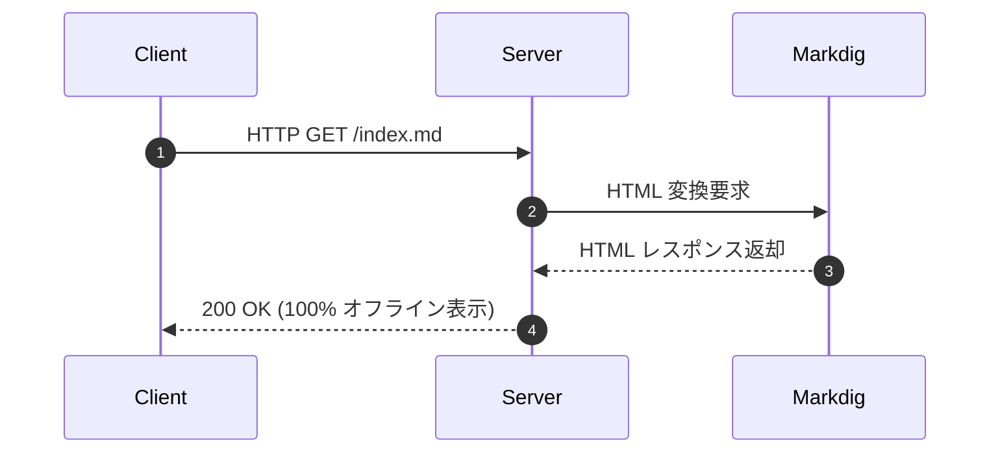

# 詳細仕様書

本ドキュメントは、SimpleWiki の詳細なルーティング機能、セキュリティ機能、および設定仕様について記載します。

## ルーティング仕様

1. **ルートアクセス (`/`)**:
   - `index.md` が存在する場合は `/index.md` を返却。
   - `index.md` が存在せず `README.md` が存在する場合は `/README.md` を返却。
2. **Markdown ページアクセス (`*.md`)**:
   - Markdig パイプラインにより GitHub 風 HTML を動的生成して返却。
3. **静的リソース (`*.png`, `*.jpg`, `*.css`, etc.)**:
   - 適切な Content-Type ヘッダーを付与してバイナリ返却。
4. **存在しないパス (404 Not Found)**:
   - ステータスコード `404` を設定し、安全に HTML エスケープされたエラーページを返却。

---

## コードブロック表示サンプル

```powershell
# ポート番号を指定して起動
.\Start-MarkdigWiki.ps1 -Port 8080
```

```cmd
:: ダブルクリック起動用バッチ
Start-MarkdigWiki.bat
```

## シーケンス図サンプル (Mermaid)



---

## パイプテーブル表示サンプル

| エラーコード | 意味 | 対策 |
| :---: | :--- | :--- |
| **403** | Forbidden (アクセス拒否) | ディレクトリトラバーサル防止機能による自動ブロック |
| **404** | Not Found (未検出) | リクエストされた Markdown または静的ファイルが存在しません |
