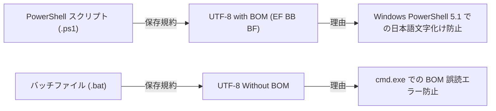
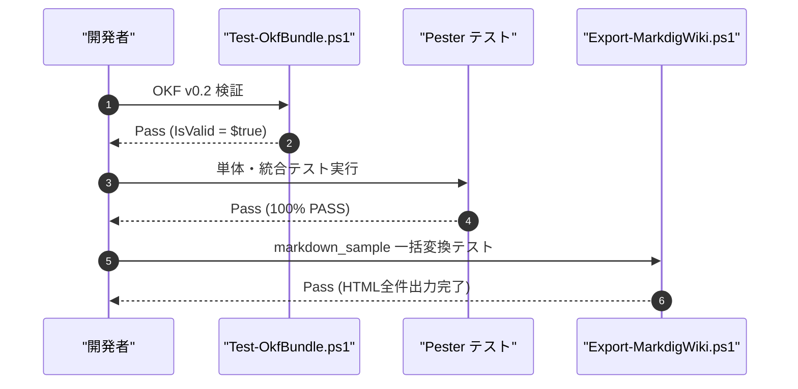

# 開発環境構築 ＆ 自動テストガイド

SimpleWiki の開発、カスタマイズ、文字コード規約、および品質検証フェーズに関する技術ガイドです。

---

## 🛠️ 開発前提条件

- **OS**: Windows 11 / Windows Server
- **ランタイム**: Windows PowerShell 5.1 または PowerShell 7+ (.NET Framework 4.8)
- **依存アセンブリ (同梱済み)**:
  - `lib/Markdig.dll` (.NET Framework 4.6.2 ビルド)
  - `lib/mermaid.min.js` (100% オフライン Mermaid 表示用)

---

## 🔤 文字コード規約 (`AGENTS.md`)

Windows PowerShell 5.1 環境での文字化けや `cmd.exe` のコマンドパースエラーを全自動で防ぐための必須規約です。



---

## 🧪 3 段階品質検証フェーズの実行

開発変更後は、以下のコマンドで 3 段階の品質検証（AST 構文チェック ➔ Pester 24 件テスト ➔ E2E エキスポート）を実行します。

### 1. Pester 単体・統合テストスイートの実行
```powershell
powershell -NoProfile -ExecutionPolicy Bypass -Command "Invoke-Pester -Path .\tests\Start-MarkdigWiki.Tests.ps1"
```

### 2. OKF バンドル適合性検証の実行
```powershell
powershell -ExecutionPolicy Bypass -File .\.agents\skills\okf-organizer\scripts\Test-OkfBundle.ps1 -Path .\markdown_sample -CheckBrokenLinks
```

### テストパイプラインフロー



---

## 🔗 関連ページへの移動
- [詳細仕様書を見る](../docs/詳細仕様.md)
- [ガイド目次に戻る](index.md)
- [REST API 仕様書を見る](../docs/api/REST-API.md)
- [ポータルに戻る](../index.md)
