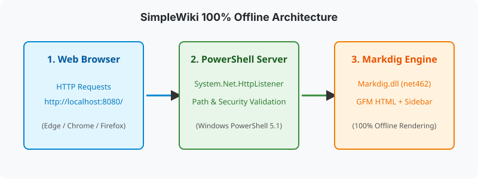

# プロジェクト概要 ＆ アーキテクチャ

SimpleWiki は、Windows PowerShell 5.1 / PowerShell 7+ の `System.Net.HttpListener` と .NET 用 Markdown レンダラ `Markdig` を組み合わせた単一ファイル構成のローカル Wiki サーバーおよび静的 HTML エキスポート基盤です。

---

## 🎯 開発背景と解決する課題

閉域網環境やセキュリティ制限の厳しい社内環境において、以下の課題を解決するために設計されました：

1. **インフラ非依存のナレッジ共有**: IIS, Apache, Docker, Node.js, Python などのランタイム追加なしに、Windows 標準の PowerShell だけで即座に Web Wiki を起動・静的 HTML 出力可能。
2. **Google OKF (Open Knowledge Format) 思想の統合**: 専用データベースやプロプライエタリな CMS に情報を閉じ込めず、リポジトリ直下の Markdown ファイル (`.md`) と標準 YAML Front Matter のみで文脈を保持。
3. **人間 (Human) と AI エージェント (RAG/LLM) の二重利用 (Dual-Use)**: 人間向けの視読性を最優先した UI レンダリングと同時に、AI エージェントが RAG コンテキストとして利用できる構造化 JSON API (`/api/index.json`, `/api/chunks.json`) を標準提供。

---

## 🏗️ システム構成図

---

## ⚙️ コアコンポーネント仕様

| コンポーネント | 技術仕様 | 役割・説明 |
| :--- | :--- | :--- |
| **OS** | Windows 11 / Windows Server | サポート対象 OS |
| **ランタイム** | Windows PowerShell 5.1 / PS 7+ | `.NET Framework 4.8` 依存（標準搭載） |
| **Web サーバー** | `System.Net.HttpListener` | ローカルポート (`http://localhost:8080/`) でのレスポンス |
| **Markdown レンダラ** | `Markdig.dll` (.NET 4.6.2) | GFM テーブル、タスクリスト、YamlFrontMatter 対応 |
| **ダイアグラム** | `lib/mermaid.min.js` | 100% オフラインでの Mermaid シーケンス図・フロー図描画 |
| **インデックス** | インメモリキャッシュ `$script:WikiIndex` | ディレクトリタイムスタンプによる高速キャッシュ |

---

## 🛡️ セキュリティ設計

1. **ディレクトリトラバーサル防止 (`403 Forbidden`)**:
   - リクエストされたファイルパスを `[System.IO.Path]::GetFullPath` で展開し、指定されたルートディレクトリの領域外へのアクセス試行を厳格に遮断します。
2. **XSS (Cross-Site Scripting) サニタイズ**:
   - URL パス、タイトル、および YAML メタデータ（`title`, `description`, `author`, `tags`）の全項目に `[System.Net.WebUtility]::HtmlEncode` を適用。

---

## 🔗 次に読むドキュメント

- [詳細仕様書を見る](docs/詳細仕様.md)
- [REST API 仕様書を見る](docs/api/REST-API.md)
- [ポータルに戻る](index.md)
