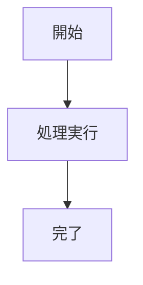

---
# OKF (Open Knowledge Format) 準拠ドキュメントテンプレート
title: "ドキュメントタイトル: サブタイトル"
description: ドキュメントの概要および目的を記述します
author: 執筆者名 (所属・チーム)
domain: カテゴリ/サブカテゴリ
tags:
  - タグ1
  - タグ2
last_updated: 2026-08-09
status: active
---

# ドキュメントタイトル

## 1. 概要
ここにドキュメントの詳細な本文を記述します。

## 2. 仕様・手順
- 項目1
- 項目2

