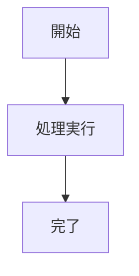

---
# OKF (Open Knowledge Format) v0.2 準拠ドキュメントテンプレート
# ※ すべてのメタデータ項目は任意（欠落しても自動補完・安全に動作）です。
type: Guide             # Concept / Guide / Architecture / Service / Table / Attested Computation
title: "ドキュメントタイトル: サブタイトル"
description: "ドキュメントの概要および目的を記述します。"
author: "主執筆者名 (所属・チーム)"
contributors:
  - "共同執筆者1"
  - "共同執筆者2"
reviewer: "レビュアー名"
domain: "カテゴリ/サブカテゴリ"
tags:
  - タグ1
  - タグ2
version: "0.2.0"
last_updated: 2026-08-16
status: stable          # active / stable / draft / review / deprecated / archived
superseded_by: ""       # 非推奨時の後継ドキュメント相対パス (例: "docs/新仕様.md")
related:
  - "docs/詳細仕様.md"
---

# ドキュメントタイトル

## 1. 概要
ここにドキュメントの詳細な本文を記述します。

## 2. 仕様・手順
- 項目1
- 項目2

